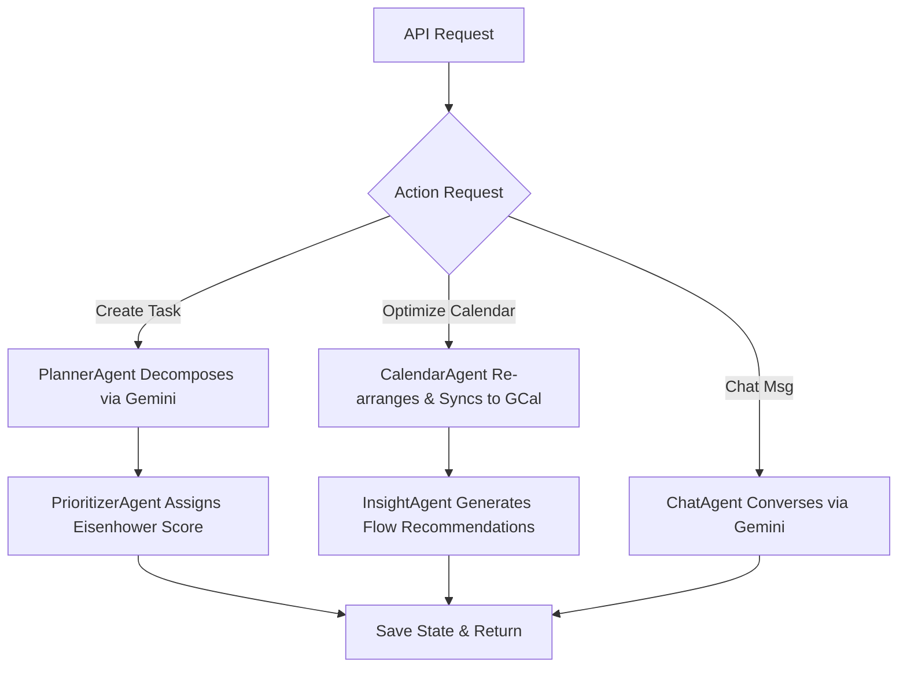

# Zenith - AI Productivity Agent Companion (Full-Stack)

Zenith is a full-stack, glassmorphic productivity dashboard. The frontend is built using **React** and **Framer Motion**, and the backend is a stateful **Python LangGraph** multi-agent workflow hosted via **FastAPI**. It integrates **Google Gemini API** for task planning, insights, and chatbot features, and **Google Calendar API** to sync optimized schedule blocks.

---

## Architecture Flow

Zenith splits cognitive reasoning across multiple specialized AI Agents, orchestrated by a state-transition graph in **LangGraph**:



---

## Setup & Execution

### 1. Backend (Python Core)

1. Navigate to the backend folder:
   ```bash
   cd backend
   ```
2. Create and activate a Python virtual environment (optional but recommended):
   ```bash
   python3 -m venv venv
   source venv/bin/activate
   ```
3. Install dependencies:
   ```bash
   pip install -r requirements.txt
   ```
4. Configure environment variables in `backend/.env`:
   ```env
   GEMINI_API_KEY=your_google_gemini_api_key_here
   ```
   *(If no API key is specified, Zenith automatically falls back to local rules-based simulators so the application stays fully functional!)*

5. Start the FastAPI server:
   ```bash
   python3 main.py
   ```
   The backend will run on **http://127.0.0.1:8000**.

---

### 2. Google Calendar API Sync Setup (Optional)

To enable Google Calendar syncing:
1. Go to the [Google Cloud Console](https://console.cloud.google.com/).
2. Create a project, enable the **Google Calendar API**, and configure the **OAuth consent screen** (set user type to External, add test users).
3. Create **OAuth client ID credentials** (Application type: Desktop App).
4. Download the JSON credentials file, rename it to `credentials.json`, and place it in the `backend/` directory.
5. The first time the CalendarAgent runs a sync, a browser tab will automatically open asking you to authenticate and grant access. A local `token.json` will be generated for subsequent automatic authorization.

---

### 3. Frontend (React + Framer Motion)

1. Navigate to the frontend folder:
   ```bash
   cd frontend
   ```
2. Install dependencies:
   ```bash
   npm install
   ```
3. Start the Vite React development server:
   ```bash
   npm run dev
   ```
4. Access the web dashboard in your browser at **http://localhost:5173**. Vite configures a proxy to automatically route API requests to the Python server on port `8000`.
